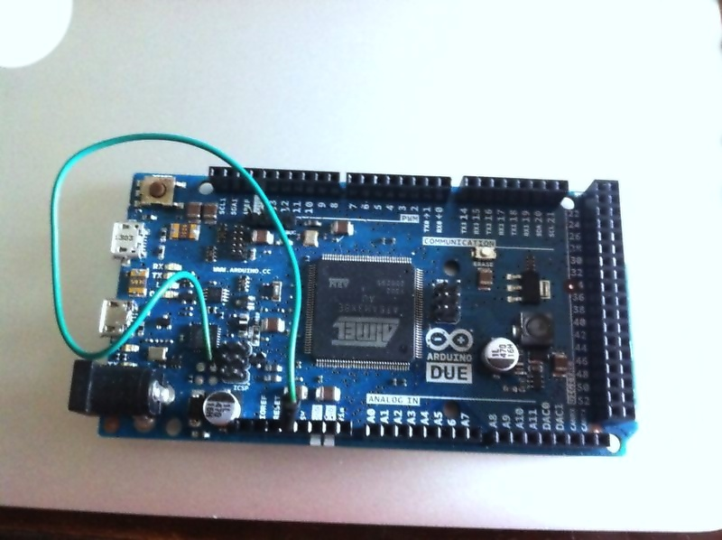
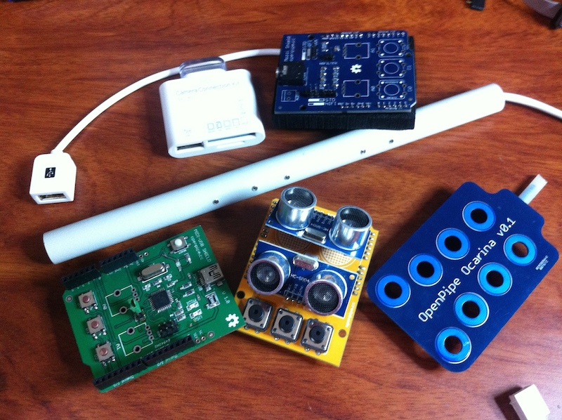

# Arduino Due Serial/MIDI dual boot 

##Overview

Create powerfull MIDI instruments with a powerfull ARM cortex M3 as heart.

Atmega [16U2](http://www.atmel.com/devices/atmega16u2.aspx "http://www.atmel.com/devices/atmega16u2.aspx") firmware for [Arduino DUE](http://arduino.cc/en/Main/arduinoBoardDue "http://arduino.cc/en/Main/arduinoBoardDue") intented to have a dualboot USB device.

* **USB CDC** Arduino DUE default behaviour. It allows to program the SAM cortex ARM M3 and also works as a Virtual COM port.
* **USB MIDI** Allows you to use Arduino DUE as a USB-MIDI device compatible with [Arduino MIDI library](http://playground.arduino.cc/Main/MIDILibrary "http://playground.arduino.cc/Main/MIDILibrary"). 
	
	
##How it works	
- Set Atmega 16U2 PB4 pin (JP5.1) to GND in order to let the firmware act as MIDI USB device
- Set JP5.1 to 3.3v for Serial CDC mode.

You can change USB mode without disconnect the DUE from USB port. The firmware detects mode change and reset automatically the USB device and re-enumerates with the new descriptors charging the new features from firmware.

####USB CDC mode

The atmega 16U2 works as in default Arduino DUE. You have an USB serial port for com purposes and can program the DUE as in original firmware.
#### USB MIDI mode
The Arduino DUE is enumerated as an USB MIDI device.

You can use the MIDI library: <http://playground.arduino.cc/Main/MIDILibrary>
This is a simple test with the MIDI library v4.2:

	#include <MIDI.h>
	int pp =0;
	#define LED 13   		// LED pin on Arduino board

	// Settings for MIDI library v4.0 an upper
	struct MySettings : public midi::DefaultSettings{
		static const bool UseRunningStatus = false; // Messes with my old equipment!
	};
	MIDI_CREATE_CUSTOM_INSTANCE(HardwareSerial, Serial, MIDI, MySettings);
	// End settings MIDI >= v4.0

	void setup() {
	  pinMode(LED, OUTPUT);
	  MIDI.begin(4);            	// Launch MIDI with default options
									// input channel is set to 4
	}

	void loop() {
	  for (pp=60;pp<81;pp++){
	    digitalWrite(LED,HIGH);     // Blink the LED
	    MIDI.sendNoteOn(pp,127,1);  // Send a Note (pitch 42, velo 127 on channel 1)
	    delay(80);		// Wait
	    MIDI.sendNoteOff(pp,128,1);   // Stop the note
	    digitalWrite(LED,LOW); 
	    delay(50);   	
	  }
	}

##PID/VID USB

You need add your PID/VID for each device at lines 49-52 in Descriptors.c

We are trying provide free PID/VID from openmoko, but at this moment we don't have response from they.

##SO compatibility
Desktop: It works with Windows XP, Win 7, Win 8(not yet tested), OSX (from Lion to Mavericks), Linux.

Mobile: It works with Android USB OTG port, iPhone (from iPhone4s) and iPad with camera kit connection as a MIDI. You can use any iOS or Android app with MIDI input/output.

##Programming firmware

* Arduino method (using dual_boot_Due.hex file): <http://arduino.cc/en/Hacking/Upgrading16U2Due>
* Using your own programmer. This is the command line for a cheapest USBASP programmer with avrdude:

		$ avrdude -p m16u2 -c USBASP -vvv -U flash:w:dual_boot_Due.hex:i
 
## Be cool and make fun instruments!!!

Now you can get all you cool stuff and make fun MIDI instruments.

##Credits

- All code was writen, mixed and shaked it by [Xulio Coira](xulioc@gmail.com "http://openpipe.cc") and [Alfredo Prado](https://twitter.com/radikalbytes "radikalbytes@gmail.com") in 2014.

- This firmware was developed using [LUFA](https://www.fourwalledcubicle.com) libraries from Dean Camera.

- MIDI device parser code is based on [MIDI USB shield](http://openpipe.cc/products/midi-usb-shield/ "http://openpipe.cc/products/midi-usb-shield/") from Xulio Coira from [openpipe.cc](http://openpipe.cc).

- Repo of MIDI USB shield: [https://github.com/openpipelabs/midi-usb-shield](https://github.com/openpipelabs/midi-usb-shield "https://github.com/openpipelabs/midi-usb-shield")

CDC serial device is based on [Arduino Due](http://arduino.cc/en/Main/arduinoBoardDue) original [firmware](https://github.com/arduino/Arduino/tree/master/hardware/arduino/firmwares/"https://github.com/arduino/Arduino/tree/master/hardware/arduino/firmwares/").

      
##License
 This firmware is under a GNU GPL v3 license.
 
 Please see [LICENSE.txt](LICENSE.txt)