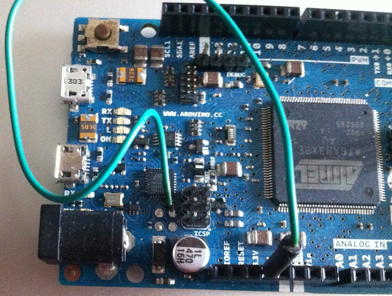

# Dual Boot 4Due 

##Overview

A firmware for Atmega 16U2 located in Arduino DUE  platform that creates a hot change double USB device:

* **USB CDC** to program the SAM cortex ARM M3 and to use as serial com port.
* **USB MIDI** device with a parser MIDI commands included to use DUE as a MIDI interface or MIDI device with a powerful ARM cortex M3 as heart. 
	
	
##How it works	
You can select the device that you want to use easily putting Atmega 16U2 PB4 pin (JP5.1) to GND for MIDI USB device or to 3.3v for Serial CDC mode.

You can change USB mode without disconnect the DUE from USB port. Firmware detects mode change and reset automatically the USB device and re-enumerates with the new descriptors charging the new features from firmware.

####USB CDC mode

The atmega 16U2 works as in a DUE original. you have an USB serial port for com purposes and can program the DUE as in original firmware.
#### MIDI mode
The Arduino DUE is enumerated as an USB MIDI device.

You can use the MIDI library: <http://playground.arduino.cc/Main/MIDILibrary>
This is a simple test with the MIDI library v4.2:

	#include <MIDI.h>
	int pp =0;
	#define LED 13   		// LED pin on Arduino board

	// Settings for MIDI library v4.0 an upper
	struct MySettings : public midi::DefaultSettings{
		static const bool UseRunningStatus = false; // Messes with my old equipment!
	};
	MIDI_CREATE_CUSTOM_INSTANCE(HardwareSerial, Serial, MIDI, MySettings);
	// End settings MIDI >= v4.0

	void setup() {
	  pinMode(LED, OUTPUT);
	  MIDI.begin(4);            	// Launch MIDI with default options
									// input channel is set to 4
	}

	void loop() {
	  for (pp=60;pp<81;pp++){
	    digitalWrite(LED,HIGH);     // Blink the LED
	    MIDI.sendNoteOn(pp,127,1);  // Send a Note (pitch 42, velo 127 on channel 1)
	    delay(80);		// Wait
	    MIDI.sendNoteOff(pp,128,1);   // Stop the note
	    digitalWrite(LED,LOW); 
	    delay(50);   	
	  }
	}

The firmware is very powerfull. 
You can make MIDI devices based on ARDUINO DUE with only an USB port for programming DUE and MIDI device.

##SO compatibility
Device works with Windows XP, Win 7, Win 8(not yet tested), OSX (from Lion to Mavericks), Linux.

You can use it too with Android USB OTG port, iPhone (from iPhone4s) and iPad with camera kit connection as a MIDI device and make fabulous electronic instruments for your MIDI apps favourites.

##Programming firmware

* Arduino method (using dual_boot_Due.hex file): <http://arduino.cc/en/Hacking/Upgrading16U2Due>
* Using your own programmer. This is the command line for a cheapest USBASP programmer with avrdude:
* *$ avrdude -p m16u2 -c USBASP -vvv -U flash:w:dual_boot_Due.hex:i*
 
## Be cool and make fun instruments!!!

Now you can get all you cool stuff and make fun MIDI instruments.

##Credits

All code was writen, mixed and shaked it by [Xulio Coira](xulioc@gmail.com "http://openpipe.cc") and [Alfredo Prado](https://twitter.com/radikalbytes "radikalbytes@gmail.com") in 2014.

This firmware was developed using [LUFA](https://www.fourwalledcubicle.com) libraries from Dean Camera, <dean@fourwalledcubicle.com>

MIDI device parser code is based on MIDI shield from Xulio Coira, <xulioc@gmail.com>
 from [openpipe.cc](http://openpipe.cc)

CDC serial device is based on [Arduino Due](http://arduino.cc/en/Main/arduinoBoardDue) original firmware.

      
##License
 This firmware is under a GNU GPL v3 license.
 
 Please see LICENSE.txt